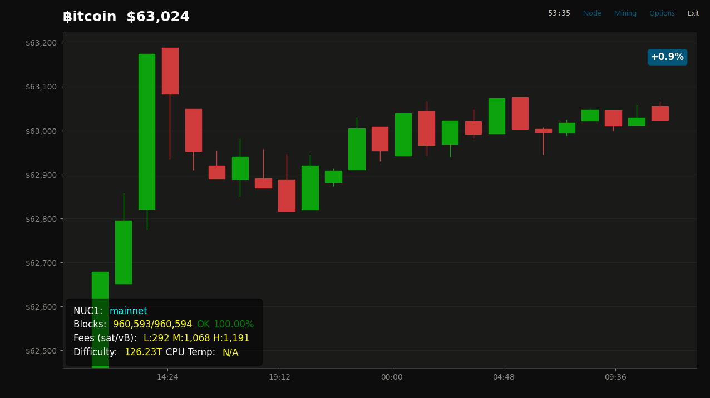
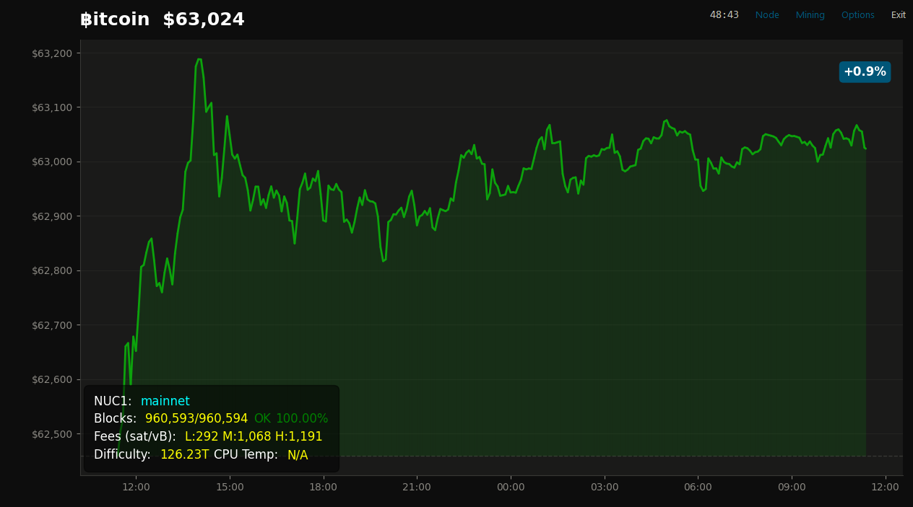
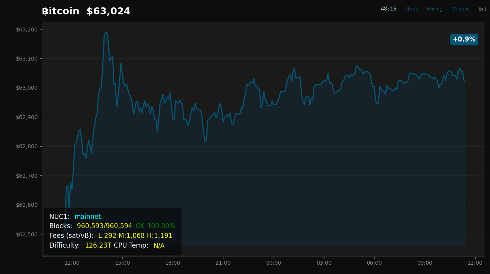
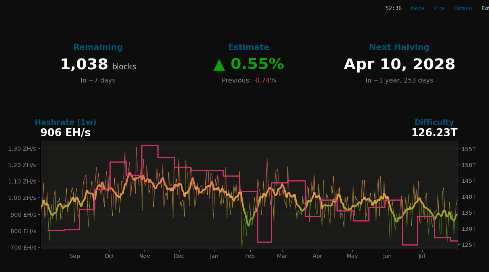
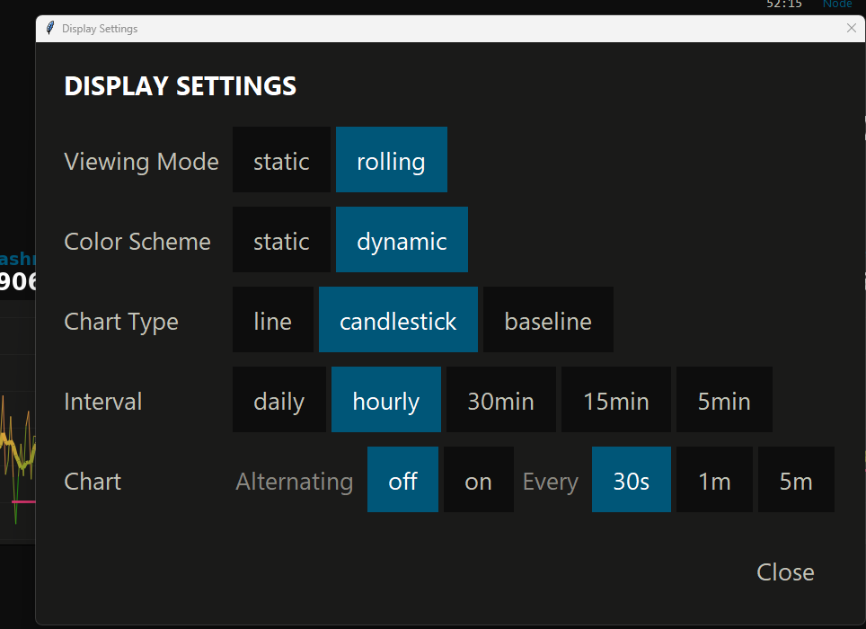
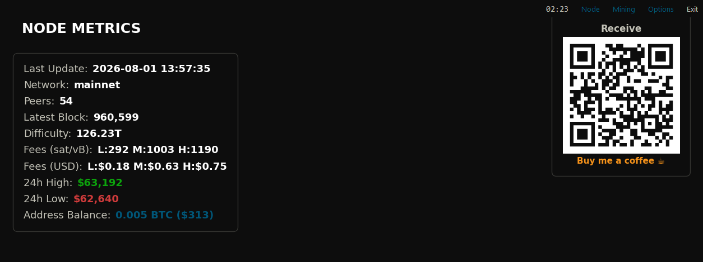

# Bitcoin Node Display (piDisplay)

This project is intended to easily give Bitcoin node runners a display for their nodes. You can create a brandnew raspberry pi configuration and connect to an existing node via RPC or run the display on top of your current node!

My build consists of a raspberry pi 4 (8gb), 1 TB HHD, and a 5" display from [Amazon](https://www.amazon.com/dp/B0CXTFN8K9).

## Screenshots

| Candlestick Price Chart | Baseline Price Chart | Line Price Chart |
|---|---|---|
|  |  |  |

| Mining Dashboard |
|---|
|  |

| Settings | Node Metrics |
|---|---|
|  |  |

## Table of Contents


- [Screenshots](#screenshots)
- [Features](#features)
- [Pre-requisites](#pre-requisites)
- [Installing piDisplay](#Installing-piDisplay)
- [Auto-Start on Boot](#auto-start-on-boot)
- [Manual Start](#manually-starting-the-program)
- [Debug / Testing](#debug--testing)
<!-- - [Usage](#usage)
- [Contributing](#contributing)
- [License](#license)
- [Contact](#contact) -->

## Features

- Graphical display of bitcoin price movement (24 hour).
- Displays 24 hour percentage change with color coordinated title.
- Mining dashboard (toggle with the "Mining" button): blocks remaining to the next difficulty adjustment, the estimated difficulty change, a next-halving countdown, and a 1-week hashrate / difficulty history chart (via mempool.space).
- Displays node information such as
    - Name of node
    - Connected chain
    - Block height and sync status
    - Low, medium, and high fee status.
    - Current difficulty.
    - CPU Temperature (pi)
- Optional receive QR code next to Node metrics, when a `WALLET_ADDRESS` is configured (see below).
- Testing capabilities included to run mock price data

## Pre-requisites
1. You should have a bitcoin node operational on your local network.
2. You should know the RPC login information (user/pwd).
3. You should be able to connect to the target display via ssh (Termius or VS Code) or terminal with a keyboard connected to the node.

Recommended node software:
1. Parmanode - https://parmanode.com/install/ (Install it on RaspiPi OS not Linux)
2. RaspiBlitz - https://github.com/raspiblitz/raspiblitz

Recommended node hardware:
1. Raspberry Pi 3+ - I used a 4B in my development but resource wise this shouldn't be too demanding.
2. Hosyond 5 Inch Touchscreen - https://www.amazon.com/dp/B0CXTFN8K9?ref_=ppx_hzsearch_conn_dt_b_fed_asin_title_4

## Ready pi
Follow these steps if you're trying to run a new Pi Display. You can copy / paste directly into the terminal.
1. Download the Pi imager from [here](https://www.raspberrypi.com/software/).
2. Open the imager.
3. Insert your Pi SD card into your computer.
4. Select your Pi device, OS, and storage option from the menu.
    - Raspberry Pi OS (64-bit) is what I used.
5. Click Next. You can opt to customize your settings so the Pi can connect to WiFi as soon as it boots.
    - Some beneficial settings include enabling SSH and setting country WLAN and timezone. Those can be changed from desktop preferences on the Pi though too.
    - ENABLE SSH AND USE PASSWORD AUTHENTICATION!
6. Confirm settings and write to the SD card.
7. Boot the Pi with the SD card and ensure you have WiFi.

### Optional: Auto-Clone & Install On First Boot
If you'd rather not type the `git clone`/`install.sh` commands over SSH at all, you can have the Pi do it itself the very first time it boots — no custom OS image required.

Imager applies the "Customisation" settings from step 5 (hostname, user account, WiFi, SSH) via a declarative file called `custom.toml`, written to the boot partition. `custom.toml` only knows how to apply those specific settings — it has no hook for running arbitrary shell commands, and there is no `firstrun.sh` on the card by default. To get the auto-clone-on-first-boot behavior, you need to create your own `firstrun.sh` and wire it up via `cmdline.txt`, using the kernel's generic `systemd.run=` first-boot mechanism:

1. After Imager finishes writing the card, re-insert it into your computer (or leave it mounted) and open the boot partition — it'll be named `bootfs` or `boot`.
2. Create a new file at the root of that partition named `firstrun.sh` containing (replacing `pi` with whichever username you set in step 5 (You need to do this on line 2,4, & 7)):
    ```bash
    #!/bin/bash
    su - pi -c '
        DEBIAN_FRONTEND=noninteractive sudo apt-get update
        DEBIAN_FRONTEND=noninteractive sudo apt-get install -y git
        cd /home/pi
        git clone https://github.com/DanielG9d9/btc_piDisplay.git
        cd btc_piDisplay
        printf "Y\nN\n" | ./install.sh > /home/pi/btc_piDisplay/first_boot_install.log 2>&1
    '
    rm -f /boot/firmware/firstrun.sh
    sed -i 's| systemd.run.*||' /boot/firmware/cmdline.txt
    exit 0
    ```
    The piped `Y` answers "yes" to enabling auto-start on boot; the `N` skips the interactive `nano config.json` prompt, since there's no terminal attached during first boot. `install.sh` also asks for a receive address afterwards, but with no terminal attached that prompt just reads EOF and gets treated as blank — same as pressing Enter to skip it — so no third answer is needed here; add `WALLET_ADDRESS` to `.env` by hand later if you want the QR code. The last two lines clean up after themselves so the script doesn't try to re-run on every subsequent boot.
3. Open `cmdline.txt`, which already exists at the root of the boot partition (Imager writes it for every card). It's a single line with no trailing newline — carefully append the following to the *end* of that existing line, separated by a space, without adding a line break:
    ```
    systemd.run=/boot/firmware/firstrun.sh systemd.run_success_action=reboot systemd.unit=kernel-command-line.target
    ```
    The paths above use `/boot/firmware` (not `/boot`) because that's where the OS mounts this partition once it's running, even though it shows up as `bootfs`/`boot` when you view the card from your computer.
4. Save both files, eject the card, and boot the Pi as normal.

This is more fragile than it used to be since Imager no longer scaffolds it for you — a mistake editing `cmdline.txt` (e.g. an extra line break) can prevent the Pi from booting correctly, so double check it's still a single line before ejecting. If you'd rather not risk it, skip this section entirely: your SSH/user/WiFi settings already come from `custom.toml` via the Imager wizard, so you can just SSH in after first boot and run the `git clone`/`install.sh` steps manually (see [Install piDisplay](#Installing-piDisplay) below).

First boot will take a few minutes longer than usual while it installs packages. Once it's up, SSH in and check `~/btc_piDisplay/first_boot_install.log` if the display doesn't appear — and don't forget you still need to create `.env` with your node's RPC details (see below), since that step was skipped automatically and there's no `.env` yet, only the committed `.env.example`.

## Install piDisplay

Follow these steps to install and set up the project:
1. Navigate to where the repository will live.
    ```bash
    cd /home/$USER/Documents # No need to replace $USER with your user profile name.

2. Clone the repository: 
    - I have used /home/$USER/Documents as my repository directory.
    ```bash
    git clone https://github.com/DanielG9d9/btc_piDisplay.git # This will clone the repository to the directory you run the command from.

3. Navigate to the repository folder you just created:
    - If you are not starting from the line above you may need to 'cd' from root `cd /home/$USER/Documents/btc_piDisplay # No need to replace $USER with your user profile name.`
    ```bash
    cd btc_piDisplay/
4. Run the install.sh file.
    ```bash
    ./install.sh # Run the script file to install dependencies.  
### Setting up your RPC connection

RPC credentials live in `.env`, not `config.json` — `config.json` is committed to git, `.env` is gitignored, so this keeps your node's username/password out of version control.

1. Copy the example file: `cp .env.example .env`
2. Edit `.env` and add one block per node you want to be able to connect to, named `RPC_<NAME>_USER`, `RPC_<NAME>_HOST`, `RPC_<NAME>_PASSWORD`, and `RPC_<NAME>_PORT` (see the comments in `.env.example` for the format).
3. In `config.json`, set `connect_to` to whichever `<NAME>` you used — that picks which block in `.env` the app reads on startup.

`install.sh` walks you through both files interactively if you let it.

### Receive QR code (optional)

To show a receive QR code next to Node metrics, set `WALLET_ADDRESS` in `.env` to a Bitcoin receive address (not an xpub). Leave it unset to skip the QR panel entirely. Like the RPC credentials, it lives in `.env` rather than `config.json` since `config.json` is committed to git.

`install.sh` will also ask for this address directly and write it to `.env` for you — just press Enter to skip it if you don't have one ready yet. You can always set or change it later by editing `WALLET_ADDRESS` in `.env` yourself.

### Customizing the config file!  

| Variable | Option |
|---|---|
| `connect_to` | Name of the RPC node profile to use — must match a `RPC_<NAME>_*` block in `.env`. |
| `time_series` | Accepts 'standard' time or will default to 24-hour format |
| `update_intervals` | Specify how often the data should update.Integers are in seconds. |
| `price` | Seconds to update -> Hourly = '3600' |
| `blockchain` | Seconds to update -> 10-minutes = '600' |
| `viewing_mode` | 'Rolling' or 'Static' - Rolling will always show full 24 hours of price data. Static will start at midnight and update with new price data until it resets the following day at midnight. |
| `chart_alternating` | 'off' or 'on' - When on, the main screen automatically alternates between the price chart and the mining dashboard. Also toggleable from Display Settings. |
| `chart_alternating_interval` | '15s', '30s', or '1m' - How often the main screen switches when `chart_alternating` is on. |
| `testing` | Specify if testing so the program will use fake data and work on a desktop display. Can also pass --testing in start command: ```python piDisplay.py --testing``` |
    
## Auto-Start On Boot
`install.sh` will ask "Enable auto-start on boot? (Y/N)". Answering `Y` installs a `systemd` service (`piDisplay.service`) that launches the display automatically once the desktop session comes up, and restarts it automatically if it ever crashes — no need to log in and double-click the desktop icon after a power loss or reboot.

If you said `N` during install and want to turn it on later (or want to turn it off), just re-run `./install.sh` from the repository folder and answer the prompt differently — it's safe to run again.

Useful commands once the service is installed:
```bash
sudo systemctl status piDisplay.service      # Check whether it's running
journalctl -u piDisplay.service -f           # Tail its logs
sudo systemctl disable --now piDisplay.service  # Turn off auto-start and stop it
sudo systemctl start piDisplay.service       # Start it manually without rebooting
```

## Manually Starting The Program
If you need to manually start the display after a reboot or any reason you can easily do so by double clicking the Run Display.sh icon and "Execute."  
  
You can also start the display remotely from your terminal via ssh!
1. Navigate to your repository folder
    ```bash
    cd /home/$USER/Documents/btc_piDisplay # Navigate to your saved directory.
2. Open the virtual environment.
    ```bash
    source bitcoin_env/bin/activate # Launch the bitcoin_env virtual environment.
3. Run the script from the virtual environment.  
    ```bash
    nohup "/.Run Display.sh" > "$(pwd)/nohup.log" 2>&1 & # Use nohup to ensure the script does not stop when you close the terminal.
## Debug & Testing
If you encounter errors an output log should be created at the location specified in the config file. By default it is set as `"log_file": "bitcoin_display.log"`, a relative path resolved against the repository directory, so the log always lands next to `piDisplay.py` regardless of your current working directory when the app is launched.

Need to kill the app from terminal? Use `pkill -f piDisplay.py`